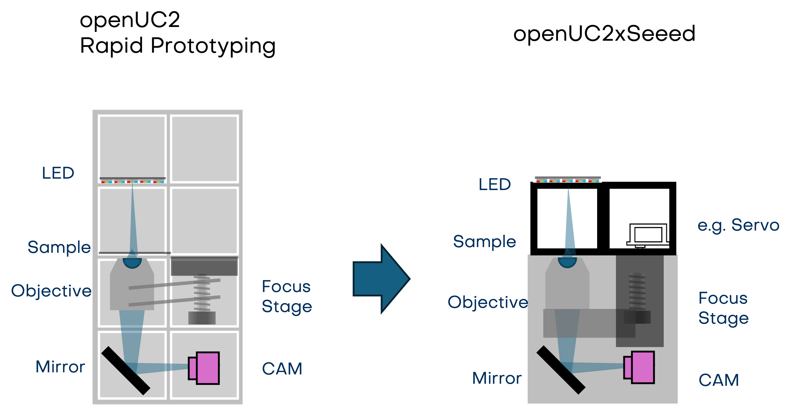
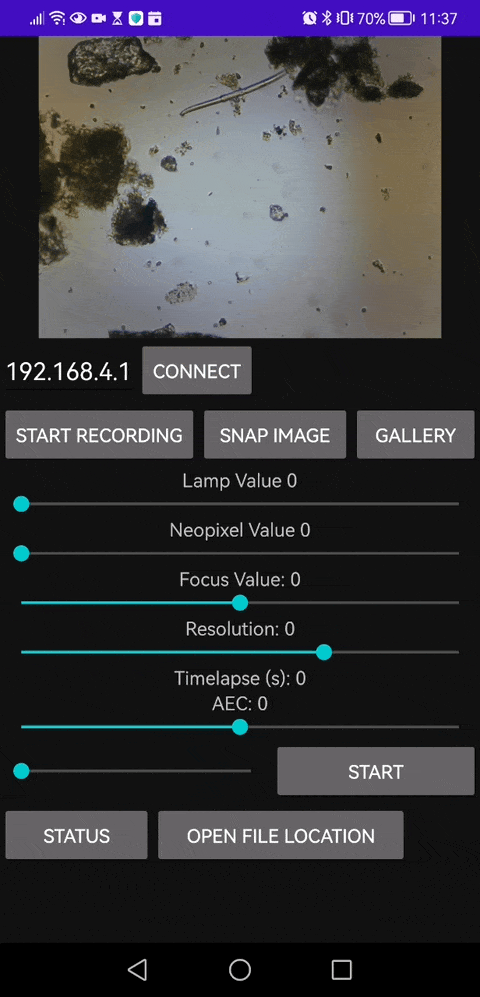

# openUC2 XIAO Microscope Documentation

:::warning Avoid colliding IDs

If you have any question, please refer to our forum: openuc2.discourse.group

:::

## Introduction

The openUC2 XIAO Microscope is a revolutionary step towards making high-quality, automated microscopy accessible to everyone. Created in collaboration with Seeed Studio, this device is ideal for hackers, optics newcomers, and biologists. It offers more functionalities than a standard USB microscope, including timelapse, autofocusing, and autonomous operation with image storage on an SD card. This guide will help you understand the capabilities of the openUC2 XIAO Microscope and provide a comprehensive tutorial for its use.

*From Rapid Prototyping in Optics to a powerful microscopy-engine for your tinkering project*

## Key Features

- **Powerful Camera**: Equipped with the ESP32-S3 camera and an OV2560 sensor, it streams high-resolution microscopic images to your screen, supported by Arduino and CircuitPython.
- **Micrometer-Precise Focus**: The metal-based focusing mechanism ensures precise movement of the objective lens, allowing for detailed studies. It supports motorized focus stacking for automation.
- **Robust Power Design**: The solid housing ensures reliability for everyday field research.
- **Swappable Microscope Objectives**: Easily change magnifications to observe live samples from different angles.
- **Customized Firmware**: Utilizes TinyML for on-the-fly image processing directly on the MCU, integrating sensors and other hardware for automated experiments.

*It's so easy to operate that even a 3-year old can do it 😃*

## Product Description

The openUC2 XIAO Microscope features a solid body, a high-quality camera for image transfer, and optics for magnification. The modular design allows for the integration of various optical elements like lenses, mirrors, or cameras housed in cubes. These cubes can be combined to create sophisticated optical assemblies, including microscopes, with the flexibility to add autofocusing modules or motorized stages.

*It's very compact and can be transported in your backpack. Ideal e.g. for a hike*

### Specifications

| Parameter           | Description                                                        |
|---------------------|--------------------------------------------------------------------|
| Processor           | ESP32-S3 SoC with a RISC-V single-core 32-bit chip, up to 160 MHz  |
| Wireless            | 2.4GHz Wi-Fi, Bluetooth 5.0/Bluetooth mesh                        |
| Optical Resolution  | 10x, 0.3 NA Objective Lens, resolution down to 4µm                |
| Interface           | UART, IIC, SPI, 11x GPIO (PWM), 4x ADC, Reset button, Boot button |
| Dimensions          | 150 x 100 x 50 mm                                                 |
| Power               | Input voltage (VIN): 5V                                           |
| Working Temperature | -40°C to 85°C                                                     |

## Main Applications

- **Timelapse Imaging**
- **Education**
- **Environmental Research**
- **Field Research**
- **Health Monitoring**
- **Rapid Prototyping**

## Comparison with Existing Microscopes

Traditional microscopes are often limited by fixed functionalities and high costs. The openUC2 XIAO Microscope's modular, open-source design offers unparalleled flexibility and affordability, making advanced microscopy accessible for educational, research, and field applications.

*The objective lens can easily

## Getting Started

The openUC2 XIAO Microscope is a combination of the MatchboxScope (based on the ESP32 camera) and the UC2 modular system. The firmware is open-source and can be flashed using a web interface.

1. Connect the Xiao via USB-C to your computer.
2. Visit [Matchboxscope Firmware](https://matchboxscope.github.io/firmware/FLASH.html) to flash the Xiao firmware.
3. The microscope creates a Wi-Fi hotspot named `OpenUC2xSeeed-XXXXX` (where `XXXXX` is the MAC address).
4. Connect to this hotspot using your laptop, tablet, or smartphone.
5. Access the web interface at `192.168.4.1` to stream images and adjust settings.

For enhanced functionality, download the [Anglerfish APP](https://github.com/Matchboxscope/Anglerfish-APP/releases) for additional features like video storage and external hardware control.

## Experiments

### Experiment 1: Flow Microscopy with External UC2 Electronics
- Use external electronics to control fluid samples and capture images as they move. Curious? Click [here](./)

### Experiment 2: Autofocus and Miniaturized Stage for Large Samples
- Implement a motorized stage for precise sample positioning and autofocusing.

### Experiment 3: Timelapse of Yeast Cells
- Capture the growth of yeast cells over time to study their behavior and development.

## Community and Support

Join our community on Discord in the #tinyml channel for support and collaboration. Explore the extensive library of UC2-compatible parts to expand the capabilities of your microscope.

For detailed tutorials and further information, visit [openUC2 GitHub Repository](https://github.com/openUC2/openUC2-SEEED-XIAO-Camera).

# Experiment 1 - Flow Microscopy

# Experiment 2 - UC2e + Microscopy

# Experiment 3 - Timelapse Imaging

HeLa Cells 

By combining the best components from the MatchboxScope and UC2 modular systems, the openUC2 XIAO Microscope offers a powerful and flexible tool for a wide range of applications, making advanced microscopy accessible to a broader audience.
