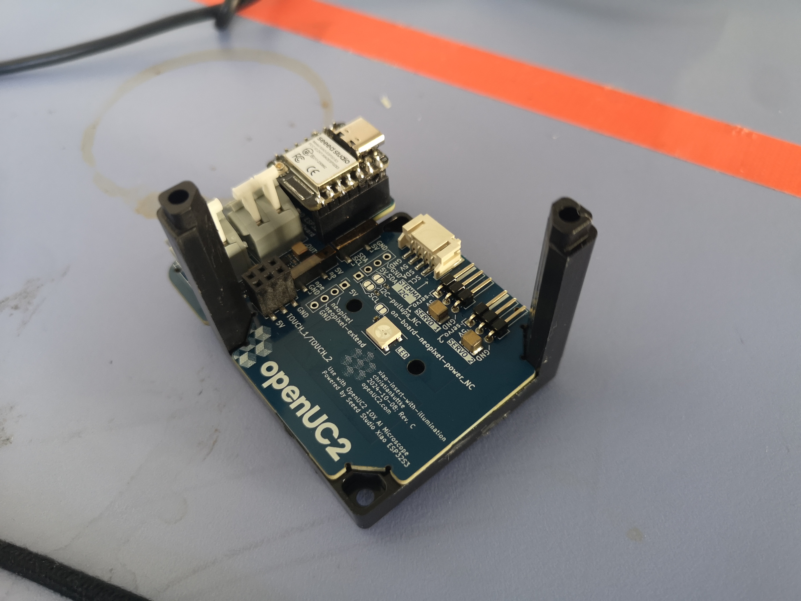
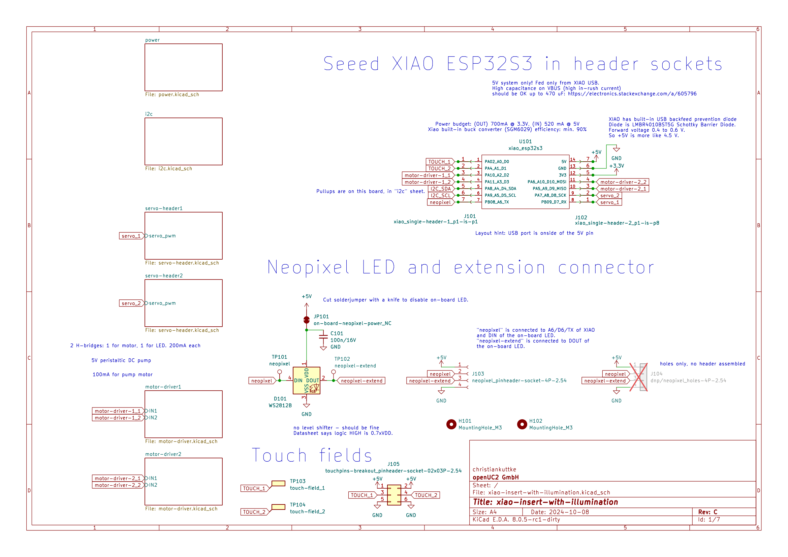
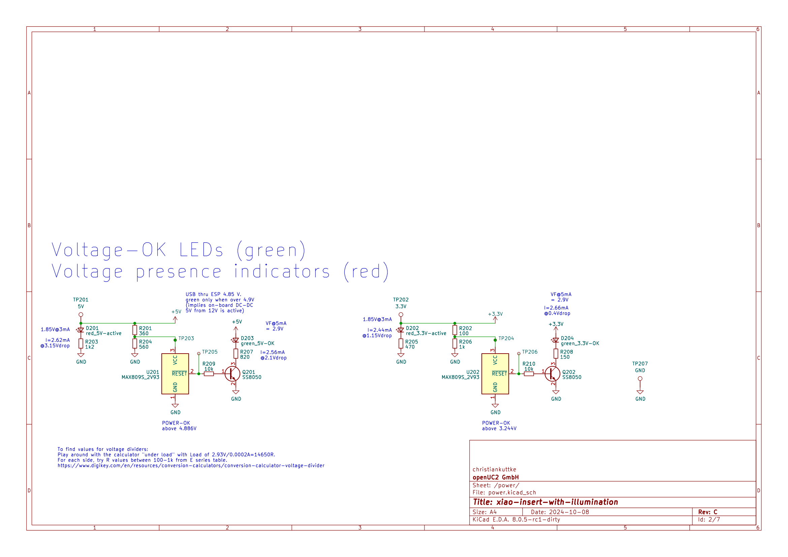
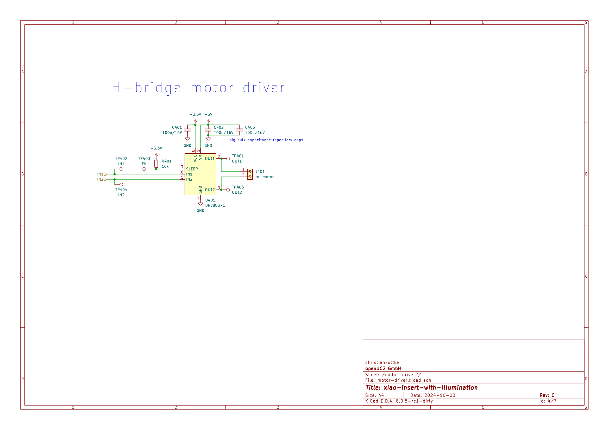

# openUC2 Xiao AI Microscope hardware control PCB

**Overview:**

This PCB connects a Seeed Studio Xiao ESP32S3 module to the openUC2 modular cube system. It features a range of components for illumination and control of motors or servos, providing an I2C bus for integration with the UC2 ecosystem. The board is primarily designed for controlling a motorized system such as peristaltic pumps and driving Neopixel LEDs, with additional support for PWM-driven components and touch inputs.


### **Components:**

1. **Microcontroller:**
   - **Seeed Studio Xiao ESP32S3**: A small ESP32-based microcontroller module, mounted via header sockets. The microcontroller is responsible for handling the firmware (UC2-ESP) and communicating with the peripherals.
   
2. **Power:**
   - Powered via **5V** input from the Xiao USB port, with a power distribution setup across the board.
   - **Voltage regulators and capacitors** (such as 100uF, 16V) ensure stable power to the motors and peripherals.

3. **Neopixel LED:**
   - **WS2812B Neopixel** mounted on the PCB, connected to the Xiao (TX/A6 pin).
   - **Optional extension connector** for additional Neopixels, allowing external LED strips or panels to be driven.
   - A **cuttable solder jumper** disables the onboard Neopixel if needed.

4. **Touch Buttons:**
   - Two **touch-sensitive fields** are connected to specific GPIO pins (marked TOUCH_1 and TOUCH_2).
   - These buttons allow for interactive input, triggering various functions (e.g., illumination control or motor activation) via the UC2-ESP firmware.

5. **Motor Drivers:**
   - **Two DRV8837C H-bridge motor drivers** are included on the board, providing control for two DC motors or a peristaltic pump.
   - Each driver has connections for **IN1, IN2**, and **OUT1, OUT2**, with bulk capacitors (100uF, 16V) ensuring stable operation.
   - The motors are powered directly from the 5V system, with a maximum load current of 200mA per driver.

6. **Servo/PWM Ports:**
   - **Two servo headers** (3-pin 2.54mm pitch) for connecting servos or other PWM-driven devices.
   - Each header provides power, ground, and a PWM signal from the Xiao, supporting standard 9g servos or similar devices.
   - Dedicated **servo PWM pins** are used to send signals to the connected servos.

7. **I2C Interface:**
   - **I2C headers (J701, J702)** provide connections for the UC2 bus system, enabling the integration of additional peripherals (such as sensors or other cubes).
   - **I2C pull-up resistors (2.2kΩ)** are included onboard, with optional solder jumpers for enabling or disabling these pull-ups.

### **Key Connections:**

1. **Microcontroller:**
   - Pin PA4_A1_D1: Connects to motor driver IN1.
   - Pin PA5_A2_D2: Connects to motor driver IN2.
   - Pin PB08_TX: Connects to Neopixel DIN for LED control.
   - I2C_SDA (PA8_A4) and I2C_SCL (PA9_A5) pins are connected to the I2C bus for external communication.

2. **Peripherals:**
   - Neopixel connected to **TX/A6** of Xiao.
   - **Touch inputs** connected to dedicated pins on the Xiao.
   - **Motor drivers** controlled via IN1 and IN2 lines from the Xiao, providing forward/reverse motor control.
   - **Servo connectors** provide power and PWM signals to connected servos.

### **Power Management:**
   - **5V input** powers the Xiao and is distributed to the other components, with onboard voltage regulation.
   - Capacitance to handle high inrush current (max. 470uF).

### **Firmware Integration:**
   - The board runs on the UC2-ESP firmware, leveraging the ESP32S3's capabilities to control motors, Neopixel LEDs, and servos while communicating over I2C.
   - Firmware includes support for both **manual control** via touch inputs and **automated sequences** for driving motors and lighting.
   
### **Usage Notes:**
   - Ensure all components are connected before powering the system via USB.
   - The onboard Neopixel can be extended by attaching an external strip to the **Neopixel Extend** port.
   - For higher power requirements, ensure adequate power supply via the USB connection.

This PCB design provides a versatile platform for integrating the Seeed Xiao ESP32S3 into the UC2 modular system, enabling advanced control of motors, servos, and lighting, with seamless integration into the UC2 bus system.

## Mounting inside a cube

It gets as easy as placing the PCB inside a cube. Et voila:



## Schematics 









## Pin Table 


| **ESP32S3 Pin**        | **PCB Port/Component**                    | **Function**                              |
|------------------------|-------------------------------------------|-------------------------------------------|
| **PA02 (A0/D0)**        | Motor Driver 1 (IN1)                     | Motor control (Input 1)                   |
| **PA04 (A1/D1)**        | Motor Driver 1 (IN2)                     | Motor control (Input 2)                   |
| **PA10 (A2/D2)**        | Motor Driver 2 (IN1)                     | Motor control (Input 1)                   |
| **PA11 (A3/D3)**        | Motor Driver 2 (IN2)                     | Motor control (Input 2)                   |
| **PA08 (A4/D4/SDA)**    | I2C SDA                                  | I2C Data Line                             |
| **PA09 (A5/D5/SCL)**    | I2C SCL                                  | I2C Clock Line                            |
| **PB08 (A6/TX)**        | Neopixel LED (DIN)                       | Neopixel Data Line                        |
| **PB09 (D7/RX)**        | Neopixel Extend (DIN)                    | Extension for external Neopixel LED       |
| **PA05 (A9/D9/MISO)**   | Touch Button 1 (TP103)                   | Touch input 1                             |
| **PA06 (A10/D10/MOSI)** | Touch Button 2 (TP104)                   | Touch input 2                             |
| **PA07 (A8/D8/SCK)**    | Servo Connector 1 (PWM)                  | PWM signal for Servo 1                    |
| **PA11 (D3)**           | Servo Connector 2 (PWM)                  | PWM signal for Servo 2                    |
| **3.3V**                | Power Supply                             | Powers Xiao and connected components      |
| **5V**                  | Power Supply (Neopixel and Motor Drivers)| Powers high-power components like motors  |
| **GND**                 | Ground                                   | Common ground for all components          |

## Sample Programm for the Arduino IDE 

Here’s a simple Arduino sketch for the ESP32S3 on the Seeed Studio Xiao module. This sketch will test the Neopixel LED, motor drivers, touch buttons, servos, and I2C functionality on the PCB. You need the required libraries installed (`Adafruit_NeoPixel`, `Wire` for `I2C`, and `ESP_Servo` for servo control). The sketch assumes the UC2-ESP firmware isn't running.

```cpp
#include <Adafruit_NeoPixel.h>
#include <Wire.h>
#include <ESP32Servo.h>  // ESP32-specific servo library

// Pin definitions for Xiao ESP32S3 (using D1, D2, etc.)
#define NEOPIXEL_PIN D6         // Neopixel data pin (TX)
#define TOUCH_PIN_1 D1          // Touch Button 1 (GPIO1)
#define TOUCH_PIN_2 D2          // Touch Button 2 (GPIO2)
#define MOTOR_1_IN1 D0          // Motor 1 IN1 (GPIO0)
#define MOTOR_1_IN2 D9          // Motor 1 IN2 (GPIO9)
#define MOTOR_2_IN1 D10         // Motor 2 IN1 (GPIO10)
#define MOTOR_2_IN2 D3          // Motor 2 IN2 (GPIO3)
#define I2C_SDA D4              // I2C SDA (GPIO4)
#define I2C_SCL D5              // I2C SCL (GPIO5)
#define SERVO_PIN_1 D8          // Servo 1 PWM (GPIO8)
#define SERVO_PIN_2 D11         // Servo 2 PWM (GPIO11)

// Motor driver setup
#define MOTOR_SPEED 255    // Max PWM value for motors

// Neopixel setup
#define NUMPIXELS 1        // Number of neopixels
Adafruit_NeoPixel neopixel(NUMPIXELS, NEOPIXEL_PIN, NEO_GRB + NEO_KHZ800);

// Servo setup
Servo servo1;
Servo servo2;

// I2C test address
const int i2cAddress = 0x3C;  // Example I2C address (adjust for your setup)

// Test variables
int touchState1 = 0;
int touchState2 = 0;

void setup() {
  // Initialize Serial for debugging
  Serial.begin(115200);

  // Initialize Neopixel
  neopixel.begin();
  neopixel.setBrightness(50);  // Adjust brightness (0-255)

  // Initialize touch pins
  pinMode(TOUCH_PIN_1, INPUT);
  pinMode(TOUCH_PIN_2, INPUT);

  // Initialize motor pins
  pinMode(MOTOR_1_IN1, OUTPUT);
  pinMode(MOTOR_1_IN2, OUTPUT);
  pinMode(MOTOR_2_IN1, OUTPUT);
  pinMode(MOTOR_2_IN2, OUTPUT);

  // Initialize I2C
  Wire.begin(I2C_SDA, I2C_SCL);

  // Initialize servos
  servo1.attach(SERVO_PIN_1);
  servo2.attach(SERVO_PIN_2);
}

void loop() {
  // Test Neopixel LED
  neopixelTest();

  // Test Touch Buttons
  touchTest();

  // Test Motor Drivers
  motorTest();

  // Test Servo Motors
  servoTest();

  // Test I2C Communication
  i2cTest();

  delay(2000);  // Wait 2 seconds before the next test cycle
}

// Neopixel Test: Cycles through colors
void neopixelTest() {
  Serial.println("Testing Neopixel...");
  neopixel.setPixelColor(0, neopixel.Color(255, 0, 0));  // Red
  neopixel.show();
  delay(500);
  neopixel.setPixelColor(0, neopixel.Color(0, 255, 0));  // Green
  neopixel.show();
  delay(500);
  neopixel.setPixelColor(0, neopixel.Color(0, 0, 255));  // Blue
  neopixel.show();
  delay(500);
}

// Touch Button Test: Reads touch inputs
void touchTest() {
  touchState1 = digitalRead(TOUCH_PIN_1);
  touchState2 = digitalRead(TOUCH_PIN_2);
  
  Serial.print("Touch Button 1: ");
  Serial.println(touchState1);
  Serial.print("Touch Button 2: ");
  Serial.println(touchState2);
}

// Motor Test: Drives both motors forward and backward
void motorTest() {
  Serial.println("Testing Motor 1...");
  // Motor 1 Forward
  digitalWrite(MOTOR_1_IN1, HIGH);
  digitalWrite(MOTOR_1_IN2, LOW);
  delay(1000);
  // Motor 1 Backward
  digitalWrite(MOTOR_1_IN1, LOW);
  digitalWrite(MOTOR_1_IN2, HIGH);
  delay(1000);
  
  Serial.println("Testing Motor 2...");
  // Motor 2 Forward
  digitalWrite(MOTOR_2_IN1, HIGH);
  digitalWrite(MOTOR_2_IN2, LOW);
  delay(1000);
  // Motor 2 Backward
  digitalWrite(MOTOR_2_IN1, LOW);
  digitalWrite(MOTOR_2_IN2, HIGH);
  delay(1000);
  
  // Stop both motors
  digitalWrite(MOTOR_1_IN1, LOW);
  digitalWrite(MOTOR_1_IN2, LOW);
  digitalWrite(MOTOR_2_IN1, LOW);
  digitalWrite(MOTOR_2_IN2, LOW);
}

// Servo Test: Sweep both servos back and forth
void servoTest() {
  Serial.println("Testing Servos...");
  for (int pos = 0; pos <= 180; pos++) {
    servo1.write(pos);
    servo2.write(pos);
    delay(15);  // Wait for the servo to reach the position
  }
  for (int pos = 180; pos >= 0; pos--) {
    servo1.write(pos);
    servo2.write(pos);
    delay(15);
  }
}

// I2C Test: Scans for I2C devices
void i2cTest() {
  Serial.println("Scanning for I2C devices...");
  Wire.beginTransmission(i2cAddress);
  if (Wire.endTransmission() == 0) {
    Serial.println("I2C device found.");
  } else {
    Serial.println("No I2C device found.");
  }
}
```

## Troubleshoot 

If you have any questions, please feel free to reach out to us using the Forum: openuc2.discourse.group. 